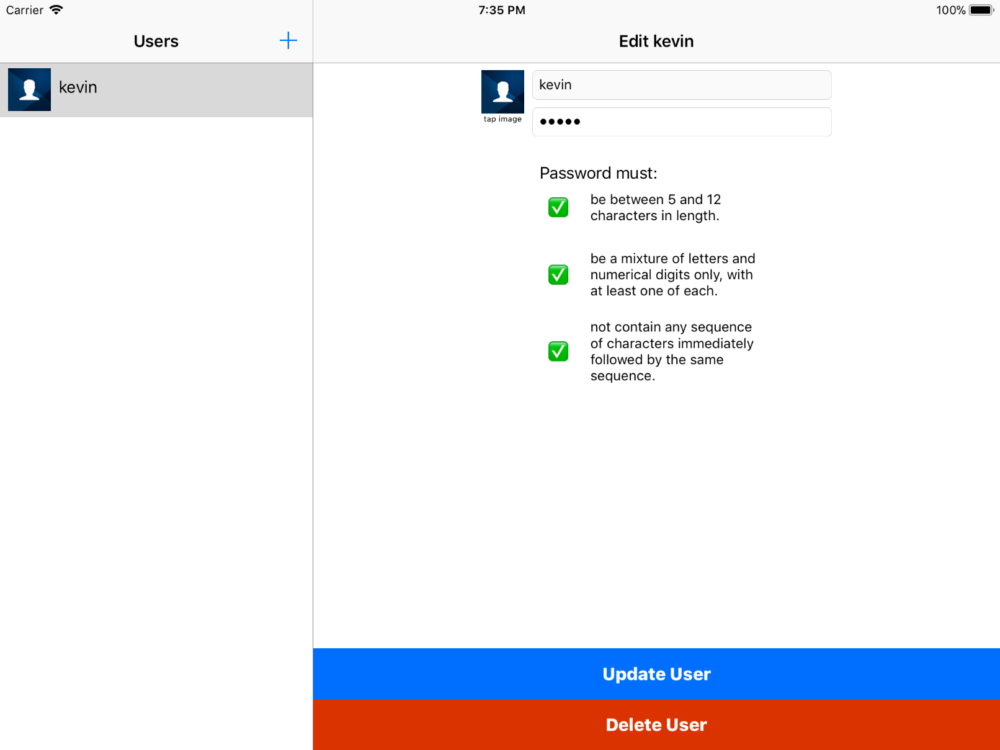
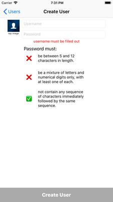
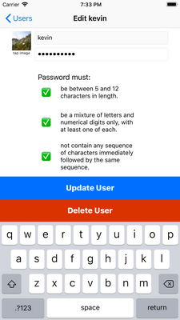
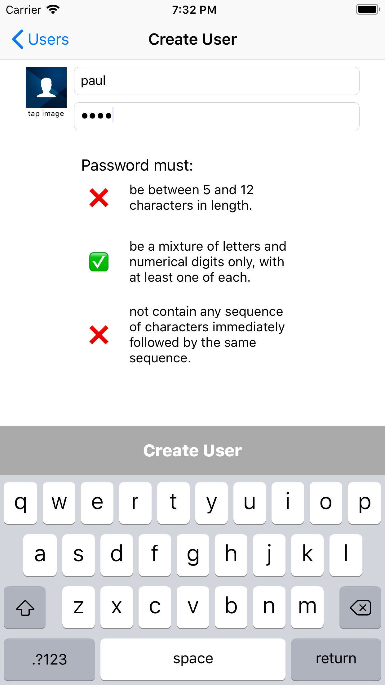

# Spectrum's Coding Test for iOS

## Objective

To fulfill the requirements in [this document](My_Spectrum_-_Xamarin_Test.pdf).

## Requirements

- XCode version 9.2
- Command line tools

## Build

### From XCode

1) Load the project file [SpectrumCodingTest.xcodeproj](SpectrumCodingTest.xcodeproj/) into XCode  
2) Select the SpectrumCodingTest scheme
3) Select what device you would like to run on
4) Click on the XCode's run button

### From the Terminal

From the terminal you can analyze, build, test, archive, export, or autobuild the entire project.  Start by `cd` to the project directory (the directory with [SpectrumCodingTest.xcodeproj](SpectrumCodingTest.xcodeproj/) in it)

**Analyze**

This will use XCode's static analysis on the project.

```
source configure.sh && \
source analyze.sh && \
analyze
```

**Build**

This will build the project without using any code signing.

```
source configure.sh && \
source build.sh && \
build
```

**Test**

This will run the unit test in the project.

```
source configure.sh && \
source test.sh && \
test
```

**Archive**

This will generate a non-codesigned archive of the project in `${PROJECT_DIR}/archive/SpectrumCodingTest.xcarchive`.

```
source configure.sh && \
source archive.sh && \
archive
```

**Export**

This will generate a codesigned IPA of the project in `${PROJECT_DIR}/archive/SpectrumCodingTest.ipa` for submittal to the iTunes AppStore.  You will have to set your codesigning certificates in XCode, and chance the exportOptions.plist team identifier to your own. 

```
source configure.sh && \
source archive.sh && \
source export_.sh \
archive \
export_
```

**Autobuild**

`autobuild` will analyze, build, test, archive, and export project.

```
./autobuild.sh
```

## Stack

- Interface Builder/XCode
- Core Data

## Architecture

4 tier architecture, project divided into the following tiers:

- Presentation
    - this layer is for everything the user sees, typically the view layer.
- Application
    - this layer updates the Presentation layer and handles events/requests from the Presentation layer. Interacts with Domain layer to retreive data from different Infrastructures
- Domain
    - abtraction layer used to de-couple the Infrastructure allowing easily change between different services.
- Infrastucture
    - Different services used for models.  Currently, only supporting Core Data.

## Screen Shots










