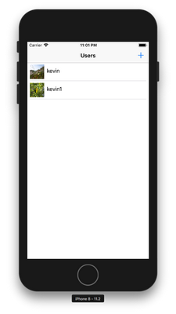

# User Manager (Local) for iOS

[](https://travis-ci.org/popmedic/swift-usermanager)
[](https://codecov.io/gh/popmedic/swift-usermanager)

## Objective

To fulfill the requirements in [this document](requirements.pdf).

## Required Tools

- XCode version 9.2
- Command line tools

## Artifact

The artifact from a build can be found in the ${PROJECT_DIR}/artifact directory.  The only artifact included in an archive (zip deployment) is a simulator build for all simulators. This "app" can be draged into a simulator and ran.  All other artifact (IPAs) would be pointless without provisioning profiles.  To generate ADHOC and AppStore artifact please follow the build instructions.

## Build

### From XCode

1) Load the project file [UserManager.xcodeproj](UserManager.xcodeproj/) into XCode
2) Select the UserManager scheme
3) Select what device you would like to run on
4) Click on the XCode's run button

### From the Terminal

From the terminal you can analyze, build, test, archive, export, or autobuild the entire project.  Start by `cd` to the project directory (the directory with [UserManager.xcodeproj](UserManager.xcodeproj/) in it)

**Analyze**

This will use XCode's static analysis on the project.

```
source configure.sh && \
source analyze.sh && \
analyze
```

**Build**

This will build the project without using any code signing.

```
source configure.sh && \
source build.sh && \
build
```

**Test**

This will run the unit test in the project.

```
source configure.sh && \
source test.sh && \
test
```

**Archive**

This will generate a non-codesigned archive of the project in `${PROJECT_DIR}/archive/UserManager.xcarchive`.  The generated achive can be used for exporting for the AppStore or ADHOC.

```
source configure.sh && \
source archive.sh && \
archive
```

**Export**

This will generate a codesigned IPA of the project in `${PROJECT_DIR}/archive/UserManager.ipa` for submittal to the iTunes AppStore.  You will have to set your codesigning certificates in XCode, and change the exportOptions.plist and exportAdhocOptions.plist team identifier to your own. 

```
source configure.sh && \
source archive.sh && \
source export_.sh \
archive \
export_
```

**Autobuild**

`autobuild` will analyze, build, test, archive, and export project.

```
./autobuild.sh
```

## Stack

- Interface Builder/XCode (Swift 4.0)
- Core Data

## Architecture

4 tier architecture, project divided into the following tiers:

```
Presentation(View)  
        ↕️️  
Application(Controller)
        ↕️ 
Domain(Controller)
        ↕️
Infrastructure(Models/Services)
```

- Presentation
    - this layer is for everything the user sees, typically the view layer.
- Application
    - this layer updates the Presentation layer and handles events/requests from the Presentation layer. Interacts with Domain layer to retreive data from different Infrastructures
- Domain
    - this layer deals with getting information from the infrastructures for the Application.
- Infrastucture
    - Different services used for models.  Currently, only supporting Core Data.

## Screen Shots





